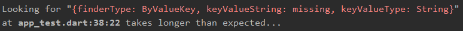

# driver_extensions

A set of Flutter Driver extension methods to make driver tests easier to write and maintain.

## Reasoning 
When Flutter driver tests fail, we have not detailed enough message:

```dart
await driver.waitFor(
  find.byValueKey('missing'),
);
```

With the extensions, you will get this message:

```dart
await driver.waitForElement(
  find.byValueKey('missing'),
);
```
